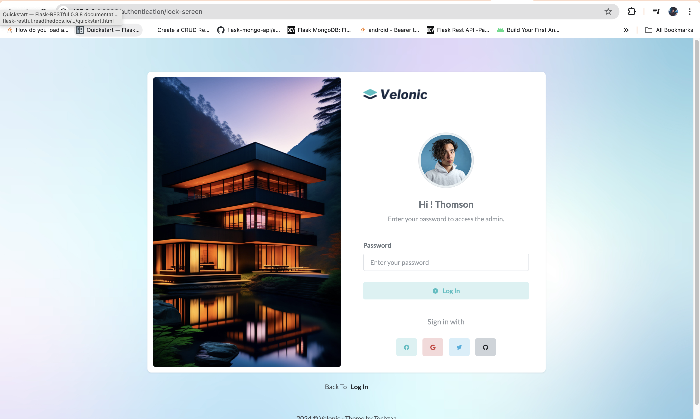

# BuzzerBoy Lab 3 - Ability to convert HTML files into a functioning django application.

In this lab, you demonstrate your ability to take a functioning HTML set of files and incorporate it into a DJANGO application. Your ability to use **URLs** , **Views** and **Templates** in DJANGO will be tested, as well as **your attention to detail** and **ability to resolve errors** is also being tested.

 
 

# **Task**
Download any one (1) of HTML Kit from the following links below and convert it into a functioning DJANGO application.

* https://www.buzzerboysites.com/html_kits/duralux-admin-dashboard-bootstrap-html-template-2024-06-14-19-03-52-utc.zip
* https://www.buzzerboysites.com/html_kits/velonic_v6_admin_uikit.zip ✅ **selected**
* https://www.buzzerboysites.com/html_kits/dashtrap_v1.0_admin_kit_bootstrap5.zip

 
 

# **Deliverables**

 

## **Deliverable 1**

✅ Please provide a link to the GITHUB where the files are located.  
* https://github.com/alibacelonia/buzzerboy-lab3/tree/main/static

✅ Please create a subdirectory called /submission-lab3 and create a lab3-task1.md file in here with all the [screenshots](#screenshots) for each feature.
* [/submission-lab3](https://github.com/alibacelonia/buzzerboy-lab3/tree/main/submission-lab3)
* [lab3-task1.md](https://github.com/alibacelonia/buzzerboy-lab3/blob/main/submission-lab3/lab3-task1.md)

✅ Please also provide any setup instructions that maybe required by the test evaluator.
* [Setup Instruction](https://github.com/alibacelonia/buzzerboy-lab3/blob/main/README.md)

✅ Please be sure to include requirements.txt to ensure evaluators can run your code.
* [requirements.txt](https://github.com/alibacelonia/buzzerboy-lab3/blob/main/requirements.txt)

 

## **Deliverable 2**

✅ Please provide [screenshots](#screenshots) from your localhost of each of the pages working. Be sure to include the address bar on
your screenshot to demonstrate that this is working as a DJANGO application.

 
 

# **Screenshots**

<!-- Dashboard -->
## **Dashboard**

 

<!-- Pages -->

## **Pages**

* ### **Starter Page**
    

* ### **Contact List**
    

* ### **Profile**
    

* ### **Timeline**
    

* ### **Invoice**
    

* ### **FAQ**
    

* ### **Pricing**
    

* ### **Maintenance**
    

* ### **Error 404**
    

* ### **Error 404-alt**
    

* ### **Error 500**
    

 

<!-- Authentication -->
## **Authentication**

* ### **Login**
    

* ### **Register**
    

* ### **Logout**
    

* ### **Forgot Password**
    

* ### **Lock Screen**
    

 

<!-- Layouts -->
## **Layouts**

* ### **Horizontal**
    

* ### **Light Sidebar**
    

* ### **Small Sidebar**
    

* ### **Collapsed Sidebar**
    

* ### **Unsticky Layout**
    

* ### **Boxed Layout**
    

 

<!-- Base UI -->
## **Base UI**

* ### **Accordions**
    

* ### **Alerts**
    

* ### **Avatars**
    

* ### **Buttons**
    

* ### **Badges**
    

* ### **Breadcrumb**
    

* ### **Cards**
    

* ### **Carousel**
    

* ### **Collapse**
    

* ### **Dropdowns**
    

* ### **Embed Video**
    

* ### **Grid**
    

* ### **Links**
    

* ### **List Group**
    

* ### **Modals**
    

* ### **Notifications**
    

* ### **Offcanvas**
    

* ### **Placeholders**
    

* ### **Pagination**
    

* ### **Popovers**
    

* ### **Progress**
    

* ### **Spinners**
    

* ### **Tabs**
    

* ### **Tooltips**
    

* ### **Typography**
    

* ### **Utilities**
    

 

<!-- Extended UI -->
## **Extended UI**

* ### **Portlets**
    

* ### **Scrollbar**
    

* ### **Range Slider**
    

* ### **Scrollspy**
    

 

<!-- Icons -->
## **Icons**

* ### **Remix Icons**
    

* ### **Bootstrap Icons**
    

* ### **Material Design Icons**
    

 

<!-- Charts -->
## **Charts**

* ### **Apex Charts**
    

* ### **Chartjs**
    

* ### **Sparkline Charts**
    

 

<!-- Forms -->
## **Forms**

* ### **Basic Elements**
    

* ### **Form Advanced**
    

* ### **Form Validation**
    

* ### **Form Wizard**
    

* ### **File Uploads**
    

* ### **Form Editors**
    

* ### **Image Crop**
    

* ### **X Editable**
    

 

<!-- Tables -->
## **Tables**

* ### **Basic Tables**
    

* ### **Data Tables**
    

* ### **Editable Tables**
    

* ### **Responsive Table**
    

 

<!-- Maps -->
## **Maps**

* ### **Google Maps**
    

* ### **Vector Maps**
    

 

<!-- Multi Level -->
## **Multi Level**

